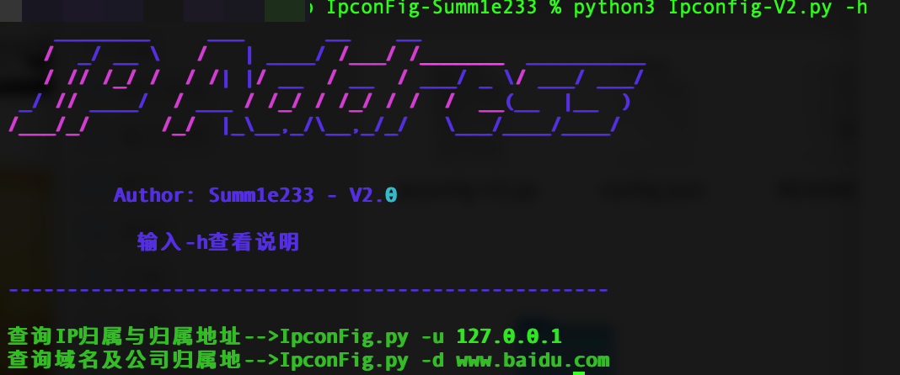
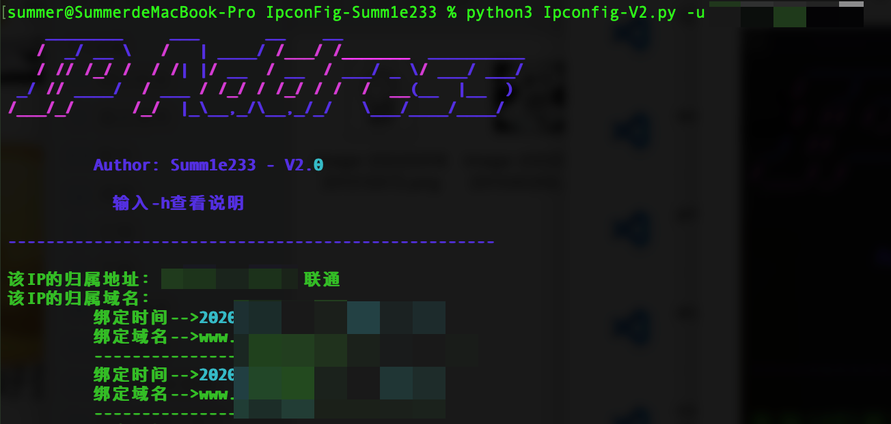
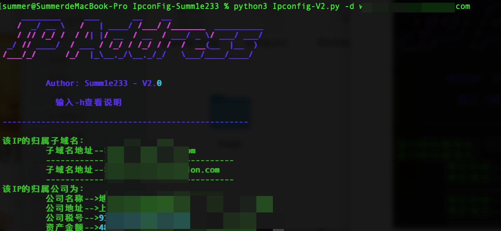
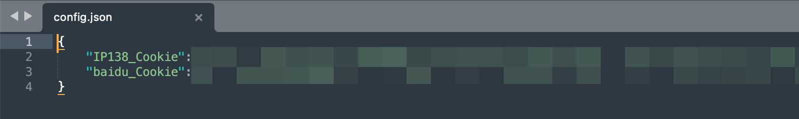
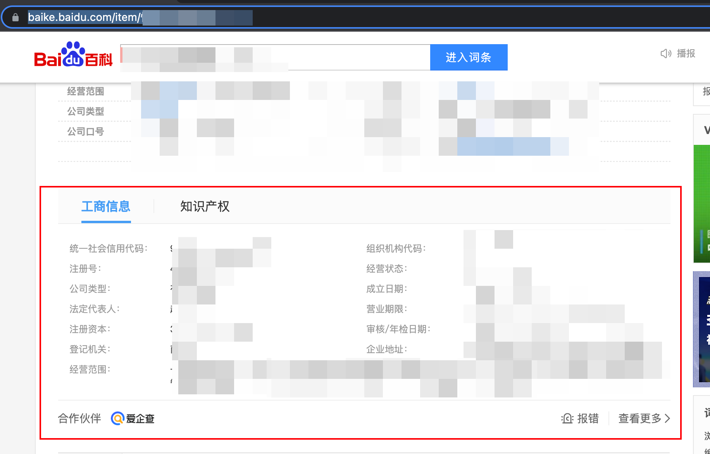
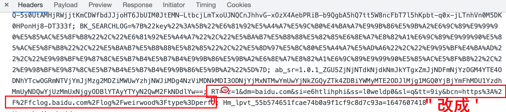
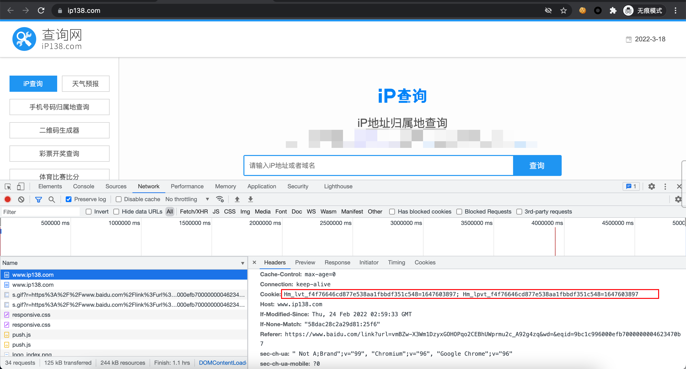
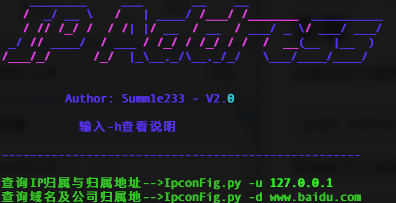

# IpconFig-Summ1e233

## 自我介绍

我们是来自一支五湖四海的信息安全爱好者，喜爱CTF、渗透、内网渗透，只为学习发声，一起共勉吧！


## 前言

​		哈喽呀，大家好，本期在Github上面分享一下小工具🔧-能快速的查找IP的归属地址与IP的子域名之类的，来帮助大家快速的认定一下CNVD或者CNNVD的实践型漏洞的挖掘认定。


## 原因

​		期间看到HXD搜的一下就认定资产工作，求了好久都不给我（疯狂记仇），这里我就发誓我要卷死他，不给我，我就自做！


## 成品图片



### 根据IP查询域名



### 根据域名查询公司及地址



## 安装

这里未来方便同学们我将需要的包都打包在-->requirements.txt

```python
pip3 install -r requirements.txt -i https://pypi.mirrors.ustc.edu.cn/simple/
```

我们需要配置一下config.json文件，需要添加2条Cookie文件,分别是IP138与爱企查的Cookie（无需登陆）



可以使用浏览器无痕模式访问

```
https://baike.baidu.com/item/企业名称
随便那个企业都行，出现如下图即可
```



使用F12大法抓到他的流量


这里重点要提醒一下，爱企查的Cookie有个坑，就是其中有个数值使用的是"我们需要改成'



第二个Cookie访问，这里就直接F12进行复制走就行

```
https://www.ip138.com/
```



安装成功之后就可以使用

```
python3 Ipconfig-V2.py -h   
```

